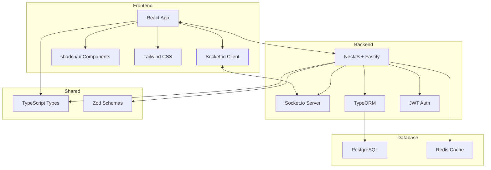
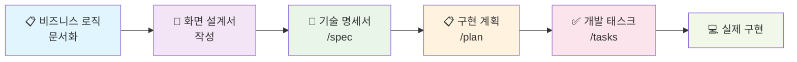

# 🧵 ThreadFileSharing

<div align="center">


**파일을 중심으로 한 혁신적인 팀 협업 플랫폼** 📁💬

[](https://reactjs.org/)
[](https://nestjs.com/)
[](https://www.typescriptlang.org/)
[](https://www.docker.com/)

</div>

---

## 🎯 프로젝트 개요

> **"파일 업로드 → 스레드 생성 → 체계적 협업"**  
> 기존 채팅 도구의 한계를 뛰어넘는 파일 중심 협업 솔루션

```
📁 파일 업로드  →  🧵 스레드 자동 생성  →  💬 체계적 토론  →  🚀 생산성 향상
```

### ✨ 핵심 가치

- 🎯 **파일이 곧 프로젝트**: 모든 파일이 독립적인 작업 공간이 됩니다
- 🔗 **자연스러운 연결**: `#스레드명`으로 채팅과 스레드를 자유롭게 연결
- 👥 **스마트한 협업**: 역할 기반 권한으로 안전하고 효율적인 팀워크
- ⚡ **실시간 동기화**: 모든 변경사항이 즉시 팀원들에게 전달

---

## 🚀 주요 기능

<table>
<tr>
<td width="50%">

### 💬 **실시간 채팅**

```
👤 김개발: 새 디자인 파일 올렸어요!
📎 design-mockup.figma (2.3MB)
[🧵 스레드 생성하기?]

👤 박디자인: 네! 피드백 남길게요
🔗 #design-review-thread
```

</td>
<td width="50%">

### 🧵 **스마트 스레드**

```
📁 design-review-thread
├── 📎 mockup-v1.figma
├── 📎 feedback.pdf
├── 💬 댓글 (12개)
└── 👥 멤버 (5명)
```

</td>
</tr>
<tr>
<td>

### 🔐 **권한 관리**

- **생성자**: 모든 권한
- **멤버**: 파일 추가, 댓글 작성
- **뷰어**: 읽기 전용

</td>
<td>

### 📱 **반응형 디자인**

- 데스크톱 최적화
- 태블릿 적응형
- 모바일 완전 지원

</td>
</tr>
</table>

---

## 🛠️ 기술 스택

<div align="center">

### Frontend


### Backend


### DevOps


</div>

---

## 🏗️ 아키텍처



---

## 📁 프로젝트 구조

```
ThreadFileSharing/
├── 📚 docs/                          # 문서화
│   ├── 📋 business/                   # 비즈니스 로직
│   │   ├── user-management.md         # 사용자 관리
│   │   ├── thread-management.md       # 스레드 관리
│   │   ├── file-sharing.md           # 파일 공유
│   │   └── ...
│   └── 🎨 screens/                   # 화면 설계서
│       ├── wireframes/               # 와이어프레임
│       ├── components/               # 컴포넌트 명세
│       └── user-flows/              # 사용자 플로우
├── 📦 packages/                      # 워크스페이스
│   ├── 🔗 shared/                    # 공유 타입 & 스키마
│   ├── 🚀 backend/                   # NestJS 백엔드
│   └── ⚛️ frontend/                  # React 프론트엔드
├── 🧪 tests/                        # 테스트
│   └── bruno/                       # API 테스트
└── 🐳 docker-compose.yml            # 개발 환경
```

---

## 🚀 시작하기

### 📋 사전 요구사항

```bash
Node.js >= 18
Docker & Docker Compose
Yarn 또는 npm
```

### ⚡ 빠른 시작

```bash
# 1️⃣ 프로젝트 클론
git clone https://github.com/username/ThreadFileSharing.git
cd ThreadFileSharing

# 2️⃣ 의존성 설치
yarn install

# 3️⃣ 개발 환경 실행
docker-compose up -d
yarn dev

# 4️⃣ 브라우저에서 확인
# 🌐 Frontend: http://localhost:3000
# 🔧 Backend:  http://localhost:3001
```

### 🔧 개발 명령어

```bash
# 🏗️ 워크스페이스 설치
yarn install

# 🚀 개발 서버 실행
yarn dev

# 🧪 테스트 실행
yarn test

# 📦 빌드
yarn build

# 🐳 Docker 환경
docker-compose up -d      # 개발 환경 시작
docker-compose down       # 환경 종료
```

---

## 📖 개발 프로세스

> **문서 우선 개발** - 체계적이고 협업하기 좋은 개발 프로세스



### 🎯 개발 단계

1. **📋 비즈니스 로직 정의** → `docs/business/`에 요구사항 문서화
2. **🎨 화면 설계** → `docs/screens/`에 와이어프레임과 사용자 플로우 작성
3. **📝 기술 명세** → `/spec` 명령어로 상세 기술 스펙 생성
4. **📋 구현 계획** → `/plan` 명령어로 단계별 개발 계획 수립
5. **✅ 태스크 생성** → `/tasks` 명령어로 구체적인 개발 작업 나열
6. **💻 코드 구현** → TDD 방식으로 테스트 먼저, 구현은 나중에

---

## 🎨 UI/UX 미리보기

<details>
<summary>📱 <strong>메인 채팅 인터페이스</strong></summary>

```
┌─────────────────────────────────────────────────────────────┐
│ 💬 #general                           👥 5 online    🔍    │
├─────────────────────────────────────────────────────────────┤
│                                                             │
│ 👤 김개발 ────────────────────────────────── 오후 2:30     │
│ 새 디자인 파일 업로드했습니다!                                 │
│ 📎 design-mockups.zip (2.3MB)                              │
│ [🧵 스레드 생성?] 👍 2  💬 답글                              │
│                                                             │
│ 👤 박디자인 ──────────────────────────────── 오후 2:32     │
│ 좋네요! #design-review-thread 에서 피드백 남길게요           │
│ 👍 3  💬 답글                                              │
│                                                             │
├─────────────────────────────────────────────────────────────┤
│ 💬 메시지 입력...                      📎    ➤             │
└─────────────────────────────────────────────────────────────┘
```

</details>

<details>
<summary>🧵 <strong>스레드 상세 화면</strong></summary>

```
┌─────────────────────────────────────────────────────────────┐
│ 🧵 Design Review - Mockups                                 │
│ 👤 김개발 생성 • 2시간 전 • 👥 3명 참여                      │
│ [✏️ 편집] [👥 초대] [⚙️ 설정]                               │
├─────────────────────────────────────────────────────────────┤
│ 📎 파일 (3개)                                              │
│ ┌─────────────────────────────────────────────────────────┐ │
│ │ 🖼️ mockup-homepage.png    2.1MB   [미리보기] [다운로드]  │ │
│ │ 📄 design-specs.pdf       890KB   [미리보기] [다운로드]  │ │
│ └─────────────────────────────────────────────────────────┘ │
│                                                             │
│ 💬 댓글 (5개)                                              │
│ ┌─────────────────────────────────────────────────────────┐ │
│ │ 👤 박디자인 • 1시간 전                                   │ │
│ │ 홈페이지 목업 정말 좋네요! 색상 조합이 마음에 들어요        │ │
│ │ 👍 2  💬 답글                                           │ │
│ └─────────────────────────────────────────────────────────┘ │
└─────────────────────────────────────────────────────────────┘
```

</details>

---

## 🎯 로드맵

### 🚀 MVP (v1.0)

- [x] 실시간 채팅 시스템
- [x] 파일 업로드 & 스레드 생성
- [x] 기본 권한 관리
- [x] 반응형 UI

### 📈 성장 단계 (v2.0)

- [ ] 고급 검색 기능
- [ ] 파일 버전 관리
- [ ] 외부 공유 링크
- [ ] 모바일 앱

### 🏢 엔터프라이즈 (v3.0)

- [ ] SSO 통합
- [ ] 고급 분석 도구
- [ ] 화이트라벨 솔루션
- [ ] API 플랫폼

---

## 🤝 기여하기

ThreadFileSharing은 오픈소스 프로젝트입니다! 기여를 환영합니다.

### 📝 기여 방법

1. **🍴 Fork** 이 저장소를 포크하세요
2. **🌿 Branch** 새로운 기능 브랜치를 생성하세요 (`git checkout -b feature/amazing-feature`)
3. **📝 Commit** 변경사항을 커밋하세요 (`git commit -m 'Add some amazing feature'`)
4. **🚀 Push** 브랜치에 푸시하세요 (`git push origin feature/amazing-feature`)
5. **🔄 Pull Request** 풀 리퀘스트를 생성하세요

### 🐛 버그 리포트

버그를 발견하셨나요? [Issues](https://github.com/username/ThreadFileSharing/issues)에서 알려주세요!

---

## 📄 라이센스

이 프로젝트는 MIT 라이센스 하에 배포됩니다. 자세한 내용은 [LICENSE](LICENSE) 파일을 참조하세요.

---

## 📞 연락처

- 📧 **이메일**: contact@threadfilesharing.com
- 💬 **디스코드**: [ThreadFileSharing Community](https://discord.gg/threadfilesharing)
- 🐦 **트위터**: [@ThreadFileShare](https://twitter.com/ThreadFileShare)

---

<div align="center">

**⭐ 이 프로젝트가 도움이 되셨다면 스타를 눌러주세요! ⭐**

Made with ❤️ by ThreadFileSharing Team


</div>
