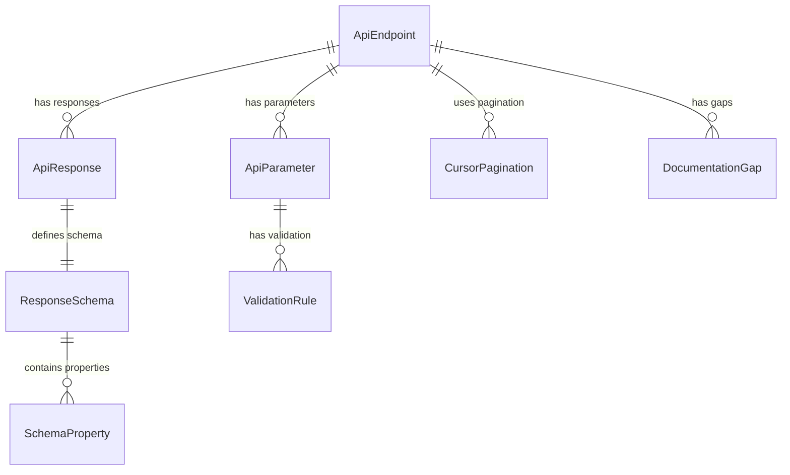
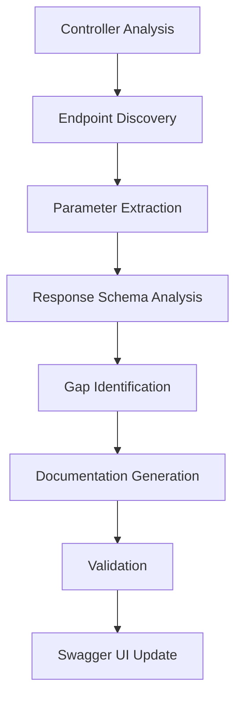
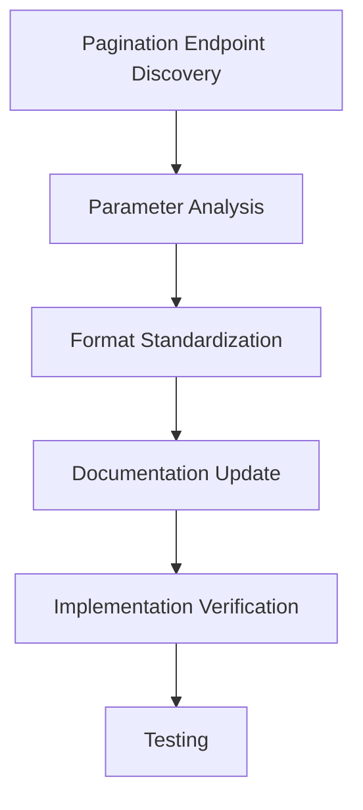

# Data Model: 백엔드 API 문서 개선 및 Swagger 응답 스키마 보완

**Date**: 2025-10-06  
**Branch**: `016-api-swagger-cursor`  
**Phase**: 1 - Design & Contracts

## Core Entities

### API Endpoint Entity

**Purpose**: Represents a single API endpoint with complete documentation metadata.

```typescript
interface ApiEndpoint {
  id: string; // Unique identifier
  path: string; // Endpoint path (e.g., "/api/v1/auth/login")
  method: HttpMethod; // HTTP method (GET, POST, PUT, DELETE, PATCH)
  controller: string; // Controller name (e.g., "AuthController")
  operationId: string; // Swagger operation ID
  summary: string; // Brief description
  description: string; // Detailed description
  parameters: ApiParameter[]; // All parameters (query, path, body)
  responses: ApiResponse[]; // All possible responses
  examples: ApiExample[]; // Request/response examples
  tags: string[]; // Swagger tags for grouping
  security: SecurityRequirement[]; // Authentication requirements
  deprecated: boolean; // Whether endpoint is deprecated
  documentationStatus: DocumentationStatus; // Completeness status
}
```

**Documentation Status Enum**:

```typescript
enum DocumentationStatus {
  COMPLETE = "complete", // All documentation present
  PARTIAL = "partial", // Some documentation missing
  INCOMPLETE = "incomplete", // Major documentation gaps
  MISSING = "missing", // No documentation
}
```

### API Parameter Entity

**Purpose**: Represents individual parameters (query, path, body) for API endpoints.

```typescript
interface ApiParameter {
  id: string; // Unique identifier
  endpointId: string; // Reference to API endpoint
  name: string; // Parameter name
  type: ParameterType; // Parameter location type
  dataType: string; // Data type (string, number, object, etc.)
  required: boolean; // Whether parameter is required
  description: string; // Parameter description
  example: any; // Example value
  schema: JsonSchema; // JSON schema definition
  validation: ValidationRule[]; // Validation rules
  deprecated: boolean; // Whether parameter is deprecated
}
```

**Parameter Type Enum**:

```typescript
enum ParameterType {
  QUERY = "query", // Query parameter (?param=value)
  PATH = "path", // Path parameter (/users/{id})
  BODY = "body", // Request body
  HEADER = "header", // Header parameter
  FORM_DATA = "formData", // Form data parameter
}
```

### API Response Entity

**Purpose**: Represents response schemas and status codes for API endpoints.

```typescript
interface ApiResponse {
  id: string; // Unique identifier
  endpointId: string; // Reference to API endpoint
  statusCode: number; // HTTP status code (200, 400, 401, etc.)
  description: string; // Response description
  schema: JsonSchema; // Response data schema
  examples: ResponseExample[]; // Example responses
  headers: ResponseHeader[]; // Response headers
  isError: boolean; // Whether this is an error response
  errorType?: ErrorType; // Type of error (if applicable)
}
```

**Error Type Enum**:

```typescript
enum ErrorType {
  VALIDATION = "validation", // 400 Bad Request
  UNAUTHORIZED = "unauthorized", // 401 Unauthorized
  FORBIDDEN = "forbidden", // 403 Forbidden
  NOT_FOUND = "not_found", // 404 Not Found
  CONFLICT = "conflict", // 409 Conflict
  INTERNAL = "internal", // 500 Internal Server Error
}
```

### Cursor Pagination Entity

**Purpose**: Represents cursor-based pagination parameters and responses.

```typescript
interface CursorPagination {
  id: string; // Unique identifier
  endpointId: string; // Reference to API endpoint
  inputParameter: string; // Input parameter name ("lastIndex")
  outputField: string; // Output field name ("nextCursor")
  format: CursorFormat; // Cursor format specification
  description: string; // Usage description
  example: CursorExample; // Example cursor values
  validation: CursorValidation; // Validation rules
}
```

**Cursor Format**:

```typescript
interface CursorFormat {
  encoding: "base64"; // Encoding method
  structure: {
    createdAt: string; // ISO date string
    id: string; // UUID or identifier
  };
  description: string; // Format description
}
```

**Cursor Example**:

```typescript
interface CursorExample {
  input: string; // Example lastIndex value
  output: string; // Example nextCursor value
  decoded: {
    createdAt: string; // Decoded createdAt
    id: string; // Decoded id
  };
}
```

### Response Schema Entity

**Purpose**: Represents complete response data structures with field definitions.

```typescript
interface ResponseSchema {
  id: string; // Unique identifier
  responseId: string; // Reference to API response
  name: string; // Schema name
  type: SchemaType; // Schema type
  properties: SchemaProperty[]; // Field definitions
  required: string[]; // Required field names
  examples: any[]; // Example values
  description: string; // Schema description
}
```

**Schema Type Enum**:

```typescript
enum SchemaType {
  OBJECT = "object", // Complex object
  ARRAY = "array", // Array of items
  PRIMITIVE = "primitive", // String, number, boolean
  REFERENCE = "reference", // Reference to another schema
}
```

**Schema Property**:

```typescript
interface SchemaProperty {
  name: string; // Property name
  type: string; // Data type
  description: string; // Property description
  example: any; // Example value
  required: boolean; // Whether property is required
  nullable: boolean; // Whether property can be null
  format?: string; // Format specification (date, uuid, etc.)
  enum?: string[]; // Enum values (if applicable)
  items?: SchemaProperty; // Array item schema (if array type)
  properties?: SchemaProperty[]; // Nested properties (if object type)
}
```

### Documentation Gap Entity

**Purpose**: Tracks missing or incomplete documentation across the API.

```typescript
interface DocumentationGap {
  id: string; // Unique identifier
  endpointId: string; // Reference to API endpoint
  gapType: GapType; // Type of documentation gap
  severity: GapSeverity; // Severity level
  description: string; // Gap description
  currentState: string; // Current documentation state
  expectedState: string; // Expected documentation state
  priority: number; // Priority for fixing (1-10)
  estimatedEffort: number; // Estimated effort in hours
}
```

**Gap Type Enum**:

```typescript
enum GapType {
  MISSING_RESPONSE_SCHEMA = "missing_response_schema",
  INCOMPLETE_PARAMETER_DOCS = "incomplete_parameter_docs",
  MISSING_ERROR_RESPONSES = "missing_error_responses",
  INCONSISTENT_PAGINATION = "inconsistent_pagination",
  MISSING_EXAMPLES = "missing_examples",
  INCOMPLETE_DTO_DOCS = "incomplete_dto_docs",
}
```

**Gap Severity Enum**:

```typescript
enum GapSeverity {
  CRITICAL = "critical", // Blocks API usage
  HIGH = "high", // Significantly impacts developer experience
  MEDIUM = "medium", // Moderate impact on developer experience
  LOW = "low", // Minor impact, nice to have
}
```

## Relationships

### Entity Relationships



### Controller Hierarchy

```typescript
interface ControllerDocumentation {
  name: string; // Controller name
  basePath: string; // Base API path
  endpoints: ApiEndpoint[]; // All endpoints in controller
  documentationStatus: DocumentationStatus; // Overall status
  gaps: DocumentationGap[]; // All gaps in controller
  paginationEndpoints: string[]; // Endpoints using pagination
}
```

## Validation Rules

### Parameter Validation

```typescript
interface ValidationRule {
  type: ValidationType; // Type of validation
  value: any; // Validation value/pattern
  message: string; // Error message
  required: boolean; // Whether validation is required
}

enum ValidationType {
  REQUIRED = "required",
  MIN_LENGTH = "minLength",
  MAX_LENGTH = "maxLength",
  PATTERN = "pattern",
  MIN_VALUE = "minValue",
  MAX_VALUE = "maxValue",
  EMAIL = "email",
  UUID = "uuid",
  DATE = "date",
}
```

### Cursor Validation

```typescript
interface CursorValidation {
  format: RegExp; // Format validation regex
  decodeable: boolean; // Must be valid Base64
  structure: boolean; // Must have required fields
  timestamp: boolean; // createdAt must be valid ISO date
  identifier: boolean; // id must be valid UUID
}
```

## Data Flow

### Documentation Generation Flow



### Pagination Standardization Flow



## Constraints

### API Documentation Constraints

1. **Backward Compatibility**: No breaking changes to existing API contracts
2. **Swagger Compliance**: Must conform to OpenAPI 3.0 specification
3. **Performance**: Documentation generation must not impact API performance
4. **Consistency**: All endpoints must follow same documentation patterns

### Pagination Constraints

1. **Parameter Naming**: Must use `lastIndex` consistently across all endpoints
2. **Format Consistency**: All cursors must use same Base64 JSON format
3. **Response Structure**: Pagination responses must include `nextCursor` and `hasMore`
4. **Validation**: Cursor values must be valid and decodeable

## Success Criteria

### Documentation Completeness

- **100% Response Schemas**: All endpoints have complete response documentation
- **100% Parameter Documentation**: All parameters are documented with examples
- **100% Error Documentation**: All error cases are documented with proper status codes
- **100% Pagination Consistency**: All pagination endpoints use `lastIndex`

### Developer Experience

- **Swagger UI Performance**: Load time < 1s
- **Example Accuracy**: All examples work correctly
- **Documentation Clarity**: No ambiguous or missing information
- **Consistency**: Uniform patterns across all controllers

---

**Data Model Complete** - Ready for Contract Definitions
